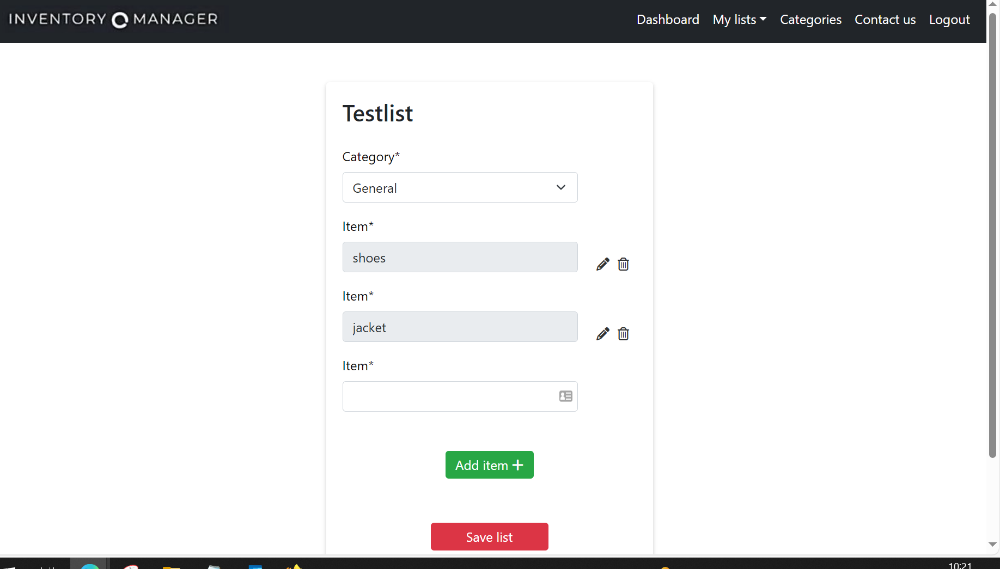
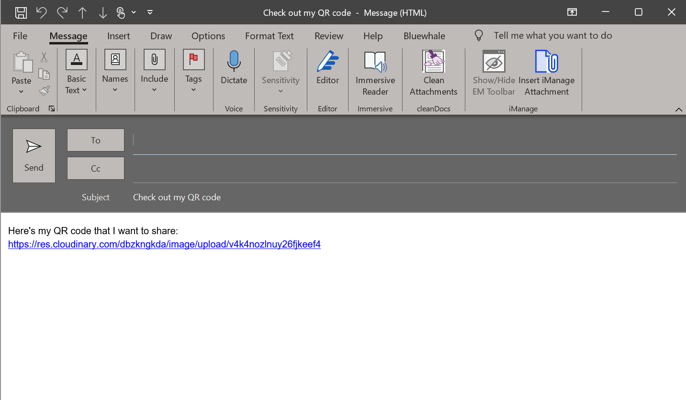

# Inventory Manager

The Inventory Manager app is built using Django and is designed to help users efficiently manage their inventories and promote sustainable living. The Inventory Manager
app provides a user-friendly interface for creating, organizing and sharing lists of items. Each list is associated with a unique QR code for easy access and sharing.

The live link can be found here - [Inventory Manager](https://inventory-manager-milen-aa94458871b4.herokuapp.com/)

## Contents

- [UI/UX](#)
    - [User Stories](#user-stories)
    - [Agile](#)
    - [Site Owner Goals](#site-owner-goals)
    - [5 planes of UX](#)
    - [Design](#design)
        - [Images](#images)
        - [Colours](#colours)
        - [Fonts](#fonts)
        - [Wireframes](#wireframes)

- [Features](#features)
  - [Navigation](#navigation)
  - [The Landing Page]()
  - [Footer](#footer)
  - 
  - 
  - [Features left to implement](#features-left-to-implement)

- [Database design](#)
    - [Database Models](#)
    - [CRUD](#)

- [Testing](#)
- [Security Features](#)

- [Technologies used](#technologies-used)

- [Languages](#languages)
- [Frameworks, Libraries and Programs](#frameworks-libraries-programs)
- [Deployment](#deployment)
    - [Heroku](#)
    - [Github](#)
- [Credits](#credits)
  - [Code](#code)
  - [Content](#content)
  - [Media](#media)
  - [Acknowledgements](#acknowledgements)

## UX/UI
## User Stories

### User Profile
- As a Site User, I can create an account so that I can start managing my inventories.
- As a Site user, I can verify my account via the verification link sent to my email upon registration.
- As a Site User, I can login to my account so that I can access my existing inventories.
- As a Site User, I can login via Google so that I have several login options.

### User Navigation
- As a Site User I can navigate easily through the site due to a responsive navbar so that I understand where to go and it is always visible to me.
- As a Site User, I can see my lists in a dropdown list from the navigation bar, so that I can navigate to my lists easily.
- As a Site User I can click on the social media links so that I can explore the work of the developer and see the developers profile.

### User Feedback
- As a Site User, I can receive feedback whenever I make an action, so that I know if my action was successful or not.

### Create Inventories
- As a Site User, I can create unique inventory lists so that I can't create inventory lists with the same name.
- As a Site User, I can create an inventory list and add multiple items at once, so that I can organize my belongings efficiently.

### Manage Inventories
- As a Site User, I can generate a QR code for my inventory so that I can identify my belongings easily.
- As a Site User, I can scan the QR code so that I can see my inventory list immediately.
- As a Site User, I can share my inventory with others using the generated QR code so that I can provide a visual and efficient view of the contents of my Inventory to others.
- As a Site User I can clone my lists so that I can reuse a list and just modify it.
- As a Site User, I can see numbers next to the inventory list name so that I can find boxes with an qr code easily if I have many boxes.

### Contact Form
- As a Site User, I can make contact through a contact form, so that I can ask questions, report issues or make suggestions.

### Site Administration
- As a Site owner I can log in to the admin dashboard using my username and password so that I can access the functionalities of the superuser.
- As a Site owner I can view a list of all inventory items so that I can edit, delete or add items, inventories and categories.
- As a Site Owner I can download the QR codes for each inventory so that I can share the QR codes with team members.
- As a Site owner I can receive messages submitted through the form so that I can respond to the messages.

## Agile
The development of this project followed an agile approach, emphasizing flexibility from initial planning to final implemenation. To facilitate the management of tasks
and user stories, a GitHub project was created, using the Kanban board method. To gain insights to the project's progress and detailed user stories, including their
associated tasks, please see link to the project board [here](https://github.com/users/MilenTecle/projects/5). Each user story has been categorized with labels indicating its importance and relevance to the overall functionality and usability of the application.

### Site Owner Goals
The primary goals of the Inventory Manager app are to provide users with an efficient and user-friendly platform for organizing and managing their belongings.
The Inventory Manager app is also intended to promote awarness of possesions to encourage suistanable and mindful consumption.
Main goals include optimizing inventory management, user engagement and integrating QR code functionality. Through a visually appealing and accessible interface,
delivering a high level of user satisfaction. Using QR codes to share inventories is designed to simplify daily life and encourage sharing or exchanging of items left unused. These goals aim to create a reliable and simple application with focus usability, security and innovation.

## 5 planes of UX

### Strategy
The strategy for the Inventory Manager app centers around meeting user needs by providing an efficient and user-friendly platform for organizing belongings.
The focus is on optimizing inventory management and creating awareness for sustainable and mindful consumption.

### Scope
The project prioritizes essential functionality, ensuring features like user registration, login, efficient inventory creation, adding items, QR code integration and secure data handling. Future features are considered based on upcoming needs and user feedback.

### Structure
The app's structure includes user-friendly navigation, seamless QR code integration, and sharing features. The design emphazises on accessibility, inclusivity and
intuitive use for a positive user experience.

### Skeleton
The Inventory Manager app is designed for easy navigation with clear interface and user flows. QR code generation, inventory sharing and secure user authentication are well integrated to enhance the overall user experience.

### Surface
The visual design of the app prioritizes clarity, accessiblity and an appealing interface. The emphasis is on creating a visually appealing and user-centric experience while maintaining focus on sustainability and awareness.

## Design

### Images
The background image on the site reflects the purpose of the quiz and the appealing image invites the user to further explore the website.

### Colours
The colour scheme used for the website blends well with the background image with a consistent look for the user. The dark colour breaks off the orange....

### Fonts
The is the font used on the website. The font was imported via [Google Fonts](https//:fonts.google.com). is the backup font....

## Wireframes
The wireframes were produced via Balsamiq.

  
Landing Page

  

  
Logged In

  

  
My Inventory

  

  
Contact Form

  

## Features
 ### Navigation

- Navbar with icon that on click will redirect not logged in user back to the landing page, and a logged in user back to the inventory page.
- Different navlinks visible for users that are not logged in and for logged in users.
- Active link is orange instead of the default white to make it clear to the user where the user is.
- Collapsible burger menu with drop-down function on small to medium screens.

  

  
Navbar not logged in

  
  

  

  
Navbar logged in

  
   

   

   
Burger menu

  
   

### The Landing Page

- Welcome text that explains the purpose with the application and invites the user to sign up with a call to action, or if user already has an account, to sign in instead.

  

  
Landing Page

  

 ### Footer

- The footer contains social media links which takes the user to my LinkedIn profile and my Github repo page for the Inventory Manager.
- The links opens in a new tab which allows for the user to navigate easy.
- A link to the privacy policy page that opens in a new tab.

   

  
Footer

  

 ### User Account
 - Django allauth was installed and is used for the user authentication functionality:
  Sign up, Email verification, Log in, Remember me, Password reset, Google and Log out.

  - Success messages informs the user if they have logged in or logged out successfully.

  - I was planning on using Facebook as a login method as well.  I decided not to proceed with the implementation due to the complexity of adding that functionality.

  

  
Sign up

  
   

  

  
Email verification

  
  

  

  
Log in

  
  

  

  
Remember me

  
  

 

  
Password reset

  
  
   

   

   
Google

  
  

   

   

 

  
Log out

  

## My Inventory
1. Once logged in, the user can create an inventory list immediately. First by choosing a unique name for the inventory list. If a list name already exists, the user will get an error message. A "General" category is provided for the user, so that the user can get started quickly and add/modify categories further on. The user will then get a success message of the created inventory list, and will be redirected to the Itemsform, to add the items to the list.

2. The user can add several items at once and will recieve a success message upon added items, and error messages if no items are added. The user can't save an empty list. When the user clicks on save list, the user will be redirected to the dashboard with a success message of successful save.

3. The list is now saved and visible on the dashboard with number 1 appended to the list name. The next list will have the number 2 and so on. The lists will alsbo be ordered alfabetically. The QR code-image is rendered when the list is saved, so the user can now scan the QR-code.

4. The user can download the QR-code image, that will open i a new tab. The user can also share the link to the QR-code via email with a prepopulated email.

5. The user can also clone a list by clicking on "clone list". There, the user can edit, delete and add items. When saved, the user will get a success message and be redirected to the dashboard where the cloned list now will be visible.

6. If the user clicks on "view details" the user will get to a view where the user can click on "edit list" or "delete list". If the user clicks on delete list, the user will be prompted to confirm deletion, and a success message will render. The user will be redirected to the Itemsform if user clicks on "edit list".

  
Create Inventory List

  
  

  
Add Items

  

  
Saved list

  

  
Scanned QR-code

  
  

  
Download QR-code

  

  
Share QR-code

  

  
Clone list

  
  

  
Edit or delete list

  
  
  

## Categories
- The user can create categories, also with unique names to prevent duplicates. The user will get an error message if a category already exists.
- When saved, the category will be visible on the category page.
- The user can edit a category by using inline editing so that the user can stay on the page, and a save button will appear. When saved, user will get a success message.
- The user can delete a category. If the user wants to delete a category the user needs to confirm deletion. The user will get a success message after deletion.

  
Add Categories

  
  
  

  
Edit or delete categories

  
  

## Contact
- All fields in the contact form are mandatory. The user will get a success messages after submitting the form.
- The user will get an automated email to their email after the submission.
- Admin will get a notification to their email of a new submission from the sender, so that admin can get a notification without manually needing to log in to the admin panel.

  
Contact form

  

  
Automated email

  
  

### Features left to implement
  - When a user shares an inventory list, the user can choose if it's only read permisson or edit and/or delete permission.
  - When a user wants to clone the orignial list again, the user will get an error message saying "The invenontory has already been cloned". I've added that as a solution to not violate the unique name constraint. In the future, I would like to implement so that
  an incrementing number, starting from 1 is appended after the word "cloned" to get around this problem.
  - Create a view on the landing page so that non registered users can see a QR code containing an example list. The share and download links are disabled so that the user can see what features are available for a registered user.
  - Let the user choose to have public or private lists so that other users can copy another users list.

## Testing
Testing and the results can be found [here](/TESTING.md).

## Security Features

### Form Validation
If empty or incorrect data is added to a form, the form won't submit. An error will arise, informing the user what field caused the error.

### User Authentication
Limits access for non-registred users and permission control so that only the owner of a list can edit and delete a list when shared with others.

### Database Security
- All passwords, API keys, ID:s and the database url are stored in the env.py file to ensure that sensitive information is not shared, along with env.py being listed in the gitignore file.
- CSRF tokens are used on all forms throughout the application.

## Technologies used

## Languages
  - HTML5
  - CSS
  - Javascript
  - Python

  ## Frameworks, Libraries and Programs
   - [Am I Responsive](https://ui.dev/amiresponsive) - Was used to ensure that the website is responsive on diffrerent devices.
   - [Balsamiq](https://balsamiq.com/) - Was used to create the wireframes before starting the project.
   - [Boostrap 5]() - Was used to style the app and make it responsive.
   - [Chrome Dev Tools](https://developer.chrome.com/docs/devtools/) - Was used on a daily basis throughout the project to make changes and to test the responsivness.
  -  [Cloudinary]() - Used to upload the QR-code images.
   - [Django]() - Main python framwork for development of this project.
   - [Django-allauth]() - Authentication library used to create the user accounts.
   - [Django-crispy-forms]() - Used to render the forms.
   - [ElephantSQL]() - PostgreSQL database hosting for this project.
   - [Font Awesome](https://fontawesome.com/) - Was used for Social Media icons in footer and for Contact information on the contact page.
   - [Gitpod](https://gitpod.io/) - Was the Codespace used for this project.
   - [Git](https://git-scm.com/) - Git was used for version control by using the Gitpod terminal to commit and then push to Github.
   - [Github](https://github.com/) - Is where the projects code is stored after being pushed.
   - [Google Fonts](https://fonts.google.com/) - Was used to import fonts to the page.
  -  [Lucid charts]() - Was used to create the ERD diagrams.
   - [PEP-8]() - Was used for Python Validation.
   - [Responsinator](http://www.responsinator.com/) - Was also used to ensure that the website is responsive on diffrerent devices.
   - [W3C](https://www.w3.org/) - Was used for HTML and CSS Validation.
   - [Web Formatter](https://webformatter.com/html) - Was used to make sure the format looks good.
  - [TinyPNG](https://jshint.com/) - .
  - [JS-hint](https://jshint.com/) - Was used for Javascript Validation.

## Deployment

### Heroku
The application was deployed to Heroku using the following steps:

Log in to Heroku
Create a new app
Navigate to settings
Navigate to Config Vars and add the following KEY/VALUE pairs:
CREDS and paste the data from the creds.json file (Only relevant if using google sheets)
Add buildpacks in the following order:
Python
nodejs
Allow Heroku to access Github and link the new app to your repository.
Choose between enabling Automatic deploys(the app will update automatically with every push to Github) or Manual Deploys.
Click on Deploy.

### Github

The project was deployed using Github pages with the following steps:
1. Go to the repository on Github.com.
2. Select 'Settings' towards the top of the page.
3. Select 'Pages' from the left menu bar.
4. Under 'Source', choose the preselected 'Branch' from the dropdown menu and then select the main branch.
5. Deployment is confirmed after a couple of minutes by the following message "Your site is published at" and there is a link to the web address.

The live link can be found here - [Inventory Manager](https://inventory-manager-milen-aa94458871b4.herokuapp.com/)

## Credits

### Code
 - I used code from here to create the playSound function:
   - [Stackoverflow play sound on click](https://stackoverflow.com/questions/33663740/play-sound-and-change-play-icon-to-stop-icon-on-click)

 - I used some of this code to create a modal box and to make it work accordingly:
   - [w3schools](https://www.w3schools.com/howto/howto_css_modals.asp)

 - I used these as inspiration to better understand how to use existing code when connecting the logic for the difficulty buttons and questions:

 - I used parts of this code to create the overlay effect:
   -
 - I used these guides to setup the functionality for EmailJS along with quidance from my mentor:

- I used these videos in general to understand the full concept
   - [Youtube](https://www.youtube.com/watch?v=PBcqGxrr9g8)
   - [Youtube](https://www.youtube.com/watch?v=riDzcEQbX6k)

### Content
The contentwere written by the developer.

### Media
Images were taken from:
 - 

### Acknowledgements
- Antonio, my mentor, for guiding med throughout the project with important suggestions to improve the quiz and funcionality.
- To my husband and family, for all the support and patience throughout this project.