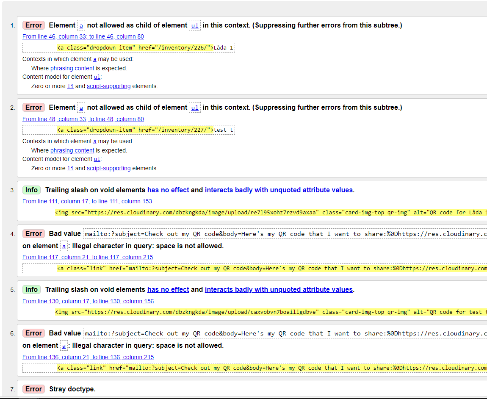
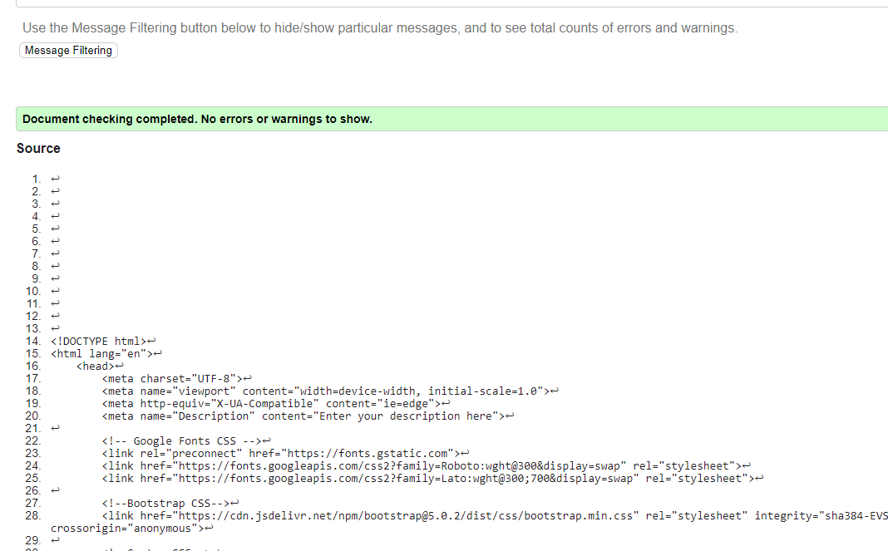
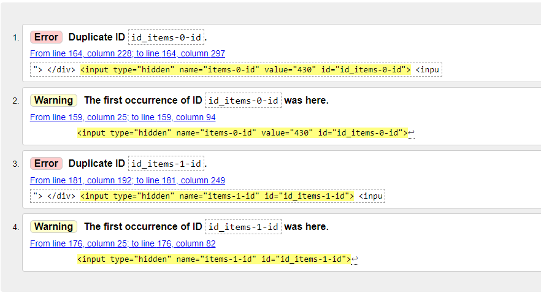
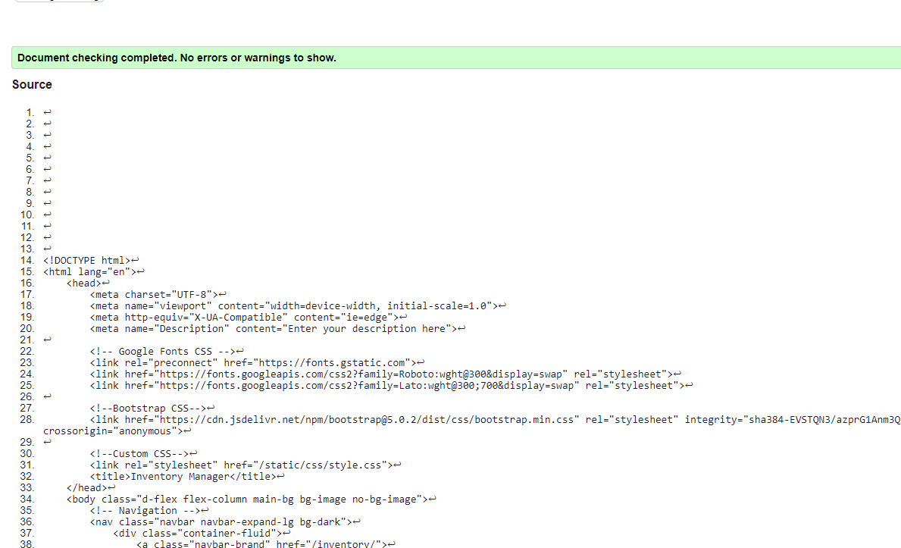
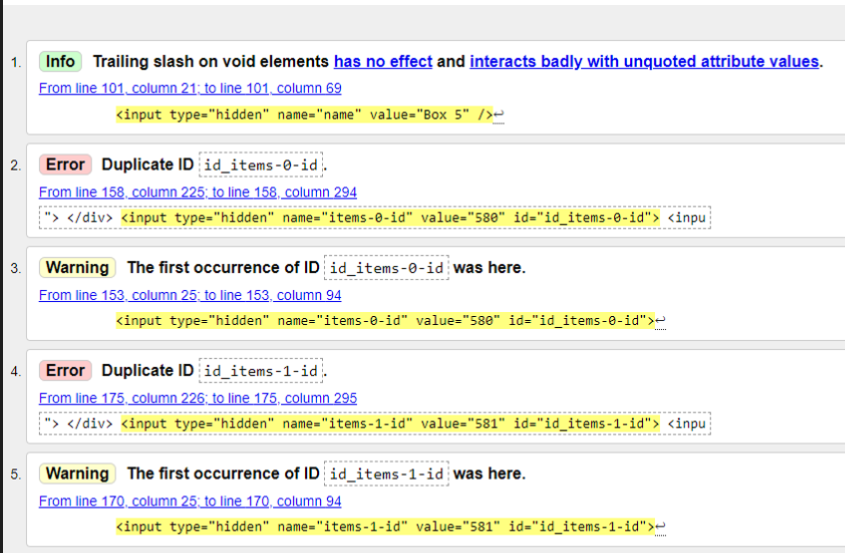
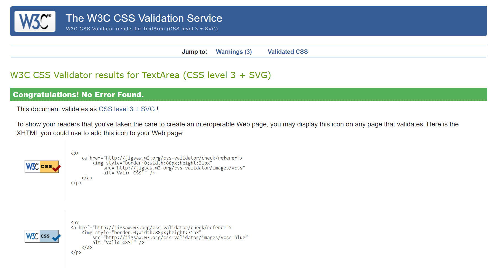
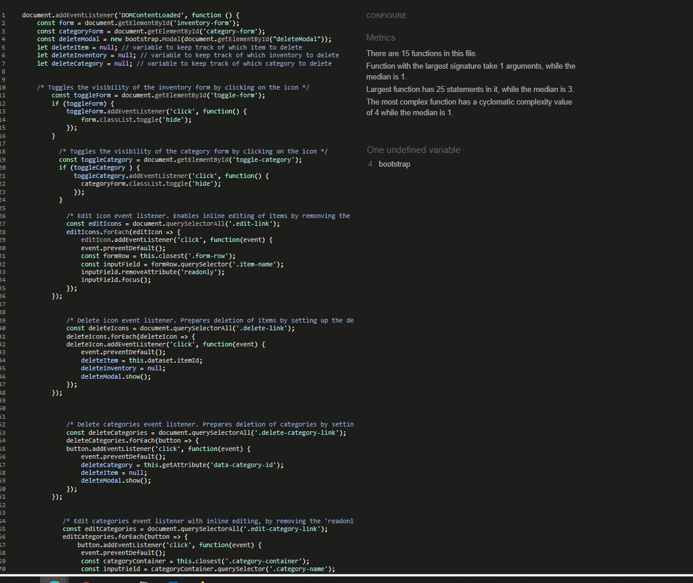
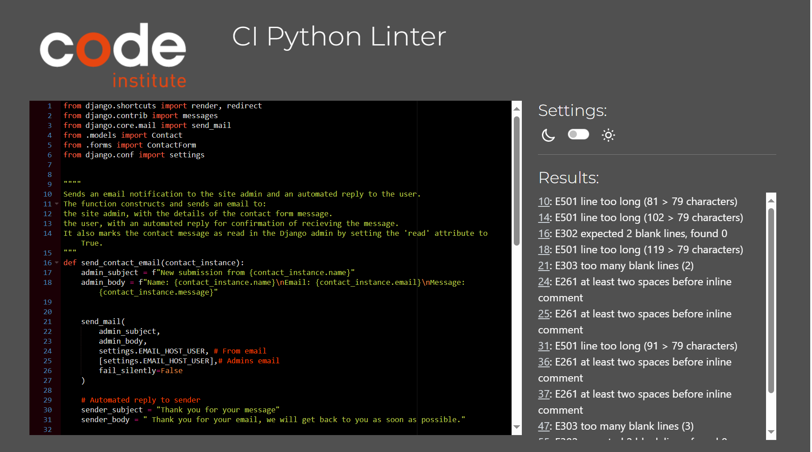
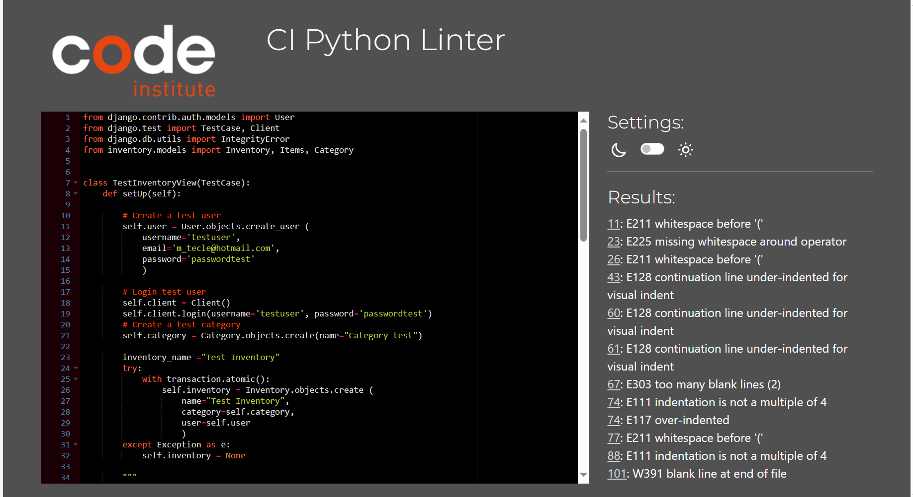
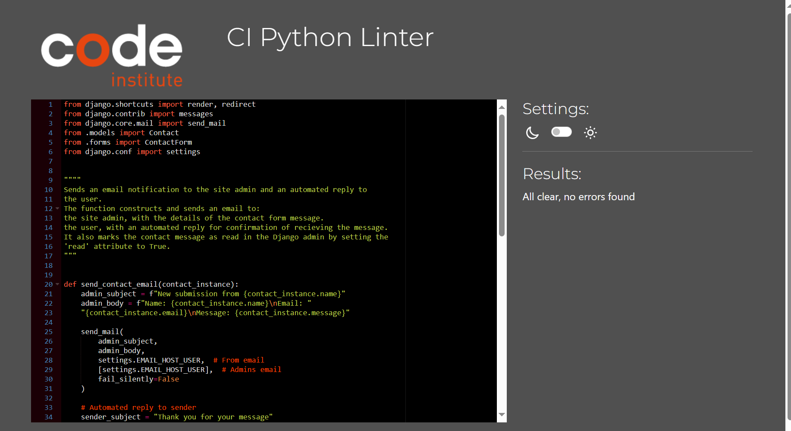

## Contents

- [User Story Testing](#user-story-testing)
- [Validator testing](#validator-testing)
    - [HTML](#)
    - [CSS](#)
    - [JavaScript](#)
    - [Python](#)
    - [Lighthouse](#)

- [Browser Testing](#features)
- [Device Testing](#features-left-to-implement)

- [Manual Testing](#)
- [Automated Testing](#)
- [Bugs](#)

## User Story Testing

## Validator Testing
### HTML
All HTML pages were run through the [W3C HTML Validator]
(https://validator.w3.org/) by pasting the source code of each page directly
into the validator. The results are listed in below table.

| Page                  | Result       |
|---------------------- |--------------|
| base.html             | No errors    |
| categories.html       | No errors    |
| contact.html          | No errors    |
| inventory_clone.html  | Errors fixed |
| inventory_detail.html | Errors fixed |
| inventory.html        | Errors fixed |
| landing_page.html     | No errors    |
| login.html  	        |              |
| logout.html           |              |
| privace_policy.html   | No errors    |
| saved_list.html       | No errors	   |
| signup.html  	        | No errors    |

 

**Fixed errors**

  
Inventory page

  
  

  
Inventory detail page

  
  

  
Inventory clone page

  
  

### CSS
No errors were found when passing my CSS file through
[W3C CSS Validator](https://jigsaw.w3.org/css-validator/).

  
CSS

  

### JavaScript
No errors were found when passing the javascript code through
[Jshint](https://jshint.com).

  
Jshint

  

### Python
All Python files were run through Pep8. A lot of errors were
returned. The errors involved too long lines, whitespaces, trailing
whitespaces, blank lines and "continuation line under-indented for visaul
indent. I resolved the trailing whitespace issue by enabling "Trim Trailing
Whitespace" in file -> preferences -> settings, under the section file here
in Gitpod. I also added a ruler in settings (settings.json) set to 78 to make
sure that the lines I needed to correct wouldn't exceed that line. I resolved
all the errors and ran the code through Pep8 again and no errors were returned.

  
Pep8 errors

  
  

  
Pep8 all clear

   

### Lighthouse

## Browser Testing
 - The Website was tested on Microsoft Edge, Google Chrome, Firefox and Safari browsers and no issues were noted.

### Device Testing
  - The website was tested and on different devices such as: Iphone 8, Iphone mini 12 and Pro, Samsung Galaxy S21, Samsung Galaxy Tab S6 lite, Ipad Mini, Laptop and Desktop to see that the website is responsive on different devices. Chrome developer tools was used to test and to check the responsivness on multiple devices.
  - I also used the following websites to test the responsivness:
  - [Responsinator]()
  - [Am I responsive]()

  ## Friends and Family
   - Family members and friends were asked to test the website for bugs and overall experience.

## Manual Testing

### Landing Page
| Feature               | Action  | Expected Result                       | Pass/Fail |
|-----------------------|---------|---------------------------------------|-----------|
| **'Sign Up' Button**  | Click   | User is directed to Sign up form      | Pass      |
| **'Sign In' Button**  | Click   | User is directed to the Sign in form  | Pass      |

### Navigation
#### Not signed In

 The navigation links and the icon, can be found in the navbar or in the drop-down menu on smaller screens.

| Feature 	           | Action    |  Expected Result                         | Pass/Fail |
|----------------------|-----------|------------------------------------------|-----------|
| **Icon**             | Click     | User is redirected back to landing page. | Pass      |
| **"Sign In" Link**   | Click     | User is directed to Login form.        | Pass      |
| **"Sign Up" Link**   | Click 	   | User is directed to Sign Up form.        | Pass      |

#### Signed In

 The navigation links and the icon, can be found in the navbar or in the drop-down menu on smaller screens.

| Feature 	           | Action    |  Expected Result                                                                 | Pass/Fail |
|----------------------|-----------|----------------------------------------------------------------------------------|-----------|
| **Icon**             | Click     | User is redirected back to Inventory page.                                       | Pass      |
| **Dashboard**        | Display   | User is on the dashboard page with dashboard beign displayed as the active link. | Pass      |
| **Categories**       | Click 	   | User is directed to Categories page.                                             | Pass      |
| **Contact us**       | Click     | User is directed to Contact page.                                                | Pass      |
| **"Log out" Link**   | Click 	   | User is directed Log out page.                                                   | Pass      |

### Links Testing
 - All navigation links on the site has been tested manually to ensure that they are working, and takes the user to the right page.
 - All the buttons were tested to ensure that the the links are working correctly.
 - The social media links were tested separately to make sure they function, and opens in a new tab.

## Automated Testing

