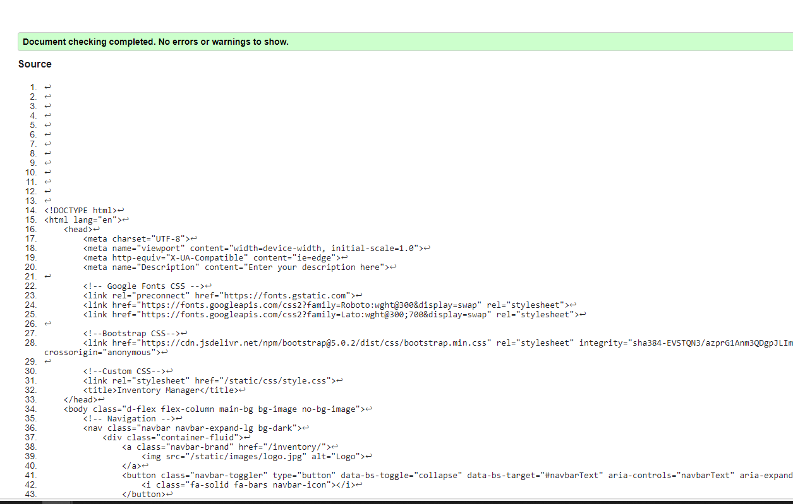
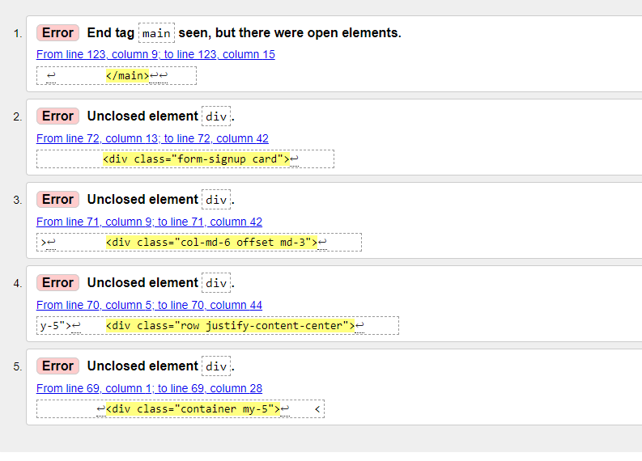

## Contents

- [User Story Testing](#user-story-testing)
- [Validator testing](#validator-testing)
    - [HTML](#html)
    - [CSS](#css)
    - [JavaScript](#javascript)
    - [Python](#python)
    - [Lighthouse](#lighthouse)

- [Browser Testing](#features)
- [Device Testing](#features-left-to-implement)

- [Manual Testing](#manual-testing)
    - [Landing page](#landing-page)
    - [Navigation](#navigation)
    - [Sign up form](#sign-up-form)
    - [Login form](#login-form)
    - [Create Inventory](#create-inventory)
    - [Add Items to inventory](#add-items-to-inventory)
    - [Dashboard](#dashboard)
    - [Saved inventory list](#saved-inventory-list)
    - [Categories](#categories)
    - [Contact Form](#contact-form)
    - [Logout](#log-out)
    - [Footer](#footer)

- [Automated Testing](#)
- [Bugs](#)

## User Story Testing

## Validator Testing
### HTML
All HTML pages were run through the [W3C HTML Validator](https://validator.w3.org/) by pasting the source code of each page directly
into the validator. The results are listed in below table.

| Page                  | Result       |
|---------------------- |--------------|
| base.html             | No errors    |
| categories.html       | No errors    |
| contact.html          | No errors    |
| inventory_clone.html  | Errors fixed |
| inventory_detail.html | Errors fixed |
| inventory.html        | Errors fixed |
| landing_page.html     | No errors    |
| login.html  	        | Errors fixed |
| logout.html           | Errors fixed |
| privace_policy.html   | No errors    |
| saved_list.html       | No errors	   |
| signup.html  	        | No errors    |

 

**Fixed errors**

  
Inventory page

  
  

  
Inventory detail page

  
  

  
Inventory clone page

  
  

  
Log In page

  
  

  
Log out page

  
  

### CSS
No errors were found when passing my CSS file through
[W3C CSS Validator](https://jigsaw.w3.org/css-validator/).

  
CSS

  

### JavaScript
No errors were found when passing the javascript code through
[Jshint](https://jshint.com).

  
Jshint

  

### Python
All Python files were run through Pep8. A lot of errors were
returned. The errors involved too long lines, whitespaces, trailing
whitespaces, blank lines and "continuation line under-indented for visaul
indent. I resolved the trailing whitespace issue by enabling "Trim Trailing
Whitespace" in file -> preferences -> settings, under the section file here
in Gitpod. I also added a ruler in settings (settings.json) set to 78 to make
sure that the lines I needed to correct wouldn't exceed that line. I resolved
all the errors and ran the code through Pep8 again and no errors were returned.

  
Pep8 errors

  
  

  
Pep8 all clear

   

### Lighthouse
Ligthouse testing was carried out in Incognito mode to achieve best results.

  
Lighthouse results desktop

   

  
Lighthouse results mobile

   

## Browser Testing

Inventory Manager was tested on Microsoft Edge, Google Chrome, Firefox and Safari browsers and no issues were noted.

| Browser               | Functionality| Layout  |
|---------------------- |------------- |---------|
| Chrome                |       ✔     |     ✔   |
| Edge                  |       ✔     |     ✔   |
| Firefox               |       ✔     |     ✔   |
| Safari                |       ✔     |     ✔   |

### Device Testing
  The website was tested on different devices to ensure responsiveness on various screen sizes. Chrome developer tools was used to test and to check the responsivness on multiple devices. I also used the [Am I responsive](https://ui.dev/amiresponsive) to test the responsivness.

| Device                | Functionality| Layout |
|---------------------- |-------------|---------|
| Iphone 8              |       ✔     |     ✔  |
| Ihone mini 12         |       ✔     |     ✔  |
| Iphone 13 Pro         |       ✔     |     ✔  |
| Samsung Galaxy S21    |       ✔     |     ✔  |
| Samsung Galaxy Tab S6 lite    |       ✔     |     ✔  |
| Laptop                |       ✔     |     ✔  |
| Desktop               |       ✔     |     ✔  |

  ## Friends and Family
   - Family members and friends were asked to test the website for bugs and overall experience.

## Manual Testing

### Landing Page
| Feature               | Action  | Expected Result                       | Pass/Fail |
|-----------------------|---------|---------------------------------------|-----------|
| **'Sign Up' Button**  | Click   | User is directed to Sign up form      | Pass      |
| **'Sign In' Button**  | Click   | User is directed to the Sign in form  | Pass      |

### Navigation
#### Not signed In

 The navigation links and the icon, can be found in the navbar or in the drop-down menu on smaller screens.

| Feature 	           | Action    |  Expected Result                         | Pass/Fail |
|----------------------|-----------|------------------------------------------|-----------|
| **Icon**             | Click     | User is redirected back to landing page. | Pass      |
| **"Sign In" Link**   | Click     | User is directed to Login form.          | Pass      |
| **"Sign Up" Link**   | Click 	   | User is directed to Sign Up form.        | Pass      |

#### Signed In

 The navigation links and the icon, can be found in the navbar or in the drop-down menu on smaller screens.

| Feature 	           | Action    |  Expected Result                                                                 | Pass/Fail |
|----------------------|-----------|----------------------------------------------------------------------------------|-----------|
| **Icon**             | Click     | User is redirected back to Inventory page.                                       | Pass      |
| **Dashboard**        | Display   | User is on the dashboard page with dashboard being displayed as the active link. | Pass      |
| **My lists**         | Click     | Once the user creates a list the user can find each list here, in a dropdown menu. when a list is clicked from here, the user is directed to the Saved List view.                                                                | Pass      |
| **Categories**       | Click 	   | User is directed to Categories page.                                             | Pass      |
| **Contact us**       | Click     | User is directed to Contact page.                                                | Pass      |
| **"Log out" Link**   | Click 	   | User is directed Log out page.                                                   | Pass      |

### Sign up form
Unauthenticated users can create an account.

| Feature            | Action  | Expected Result                                                                                                                                                     | Pass/Fail |
|--------------------|---------|---------------------------------------------------------------------------------------------------------------------------------------------------------------------|-----------|
| **Sign up form**   | Display | Renders the following input fields: Email, username, password and password confirm.                                                                                 | Pass      |
| **Submit** | Click | User is redirected to a page where the user is informed that a verification link has been sent and the user needs to verify by clicking on that link, from their mail. After verification, the user will see the sign-in form instead. | Pass      |
|**Form incomplete** | Display | Incorrect or incomplete fields will be displayed with the relevant error and the user will remain on the page. | Pass |
| **"Sign In" Link** | Click | If user aldready has an account, user can click on the link leading to the sign in form instead. | Pass      |

### Login form

Authenticated users can sign in to existing account.

| Feature               | Action  | Expected Result                                             | Pass/Fail |
|-----------------------|---------|-------------------------------------------------------------|-----------|
| **Login form**        | Display | Renders the following input fields: username and password.  | Pass      |
| **Submit** | Click | Upon successful login, user is re-directed to the dashboard, with a self-closing success message with the username.  | Pass
|**Form incomplete** | Display | Incorrect or incomplete fields will be displayed with the relevant error and the user will remain on the page. | Pass |
| **Remember me**       | Check | When the "remember me" checkbox is ticked, the form is pre-populated with username and hidden password when user logs in again after the user have logged out.  | Pass      |
| **Password reset**    | Click | When clicked, the user is directed to the password reset page where the user fills out their email and submits. An email with the reset link is then sent to the user.  | Pass      |
| **''Google' button**  | Click   | User is directed to a separate page where user needs to confirm logging in with a third party. After that user needs to enter email and password for gmail. Upon successful login, user is re-directed to the dashboard, with a self-closing success message with the username.  | Pass      |
| **"Sign Up" Link** | Click | If user doesn't have an account, user can click on the link leading to the sign up form instead. | Pass      |

### Create Inventory

Authenticated users can create inventory lists.

| Feature              | Action  | Expected Result                                      | Pass/Fail |
|----------------------|---------|------------------------------------------------------|-----------|
| **Plus sign icon**   | Click   | The inventory form is toggled                        | Pass      |
| **Inventory Form**   | Display | The input field and category dropdown are rendered.  | Pass      |
| **Submit**           | Click   | User is redirected to the Itemsform upon successful login, with a self-closing success message  | Pass      |
|**Form incomplete**   | Display | Incorrect or incomplete field will be displayed with the relevant error and the user will remain on the page. | Pass |
| **Unique name**      | Display | The list name needs to be unique. If not an error message will display and user will remain on the page.  | Pass      |

Authenticated users can add items to their inventory lists as well as edit and delete items.

### Add Items to inventory
| Feature              | Action  | Expected Result                                      | Pass/Fail |
|----------------------|---------|------------------------------------------------------|-----------|
| **Add item button**  | Click   | If user clicks without adding an item an self-closing error message will display and user remains on the page. User can add multiple items by clicking on add item.                  | Pass      |
| **Edit and delete icons**   | Display | Once an item is added, an edit and delete icon will be visible on the same row.  | Pass      |
| **Edit icon**   | Click| When clicked, the readonly attribute is removed from the items row and inline editing is enabled.  | Pass
| **Delete icon**   | Click| When clicked a confirm delete modal will display. If confirmed, a self-closing success message will display and user will stay in the Itemsform.  | Pass
| **Save list without items**   | Display | An error message will display and user remains on the page.  | Pass      |
| **Submit**           | Click| User is redirected to the Dashboard upon successful login, with a self-closing success message.   | Pass      |

## Dashboard
Authenticated users can see their inventory lists on the dashboard along with functionalities such as: scan QR-code, download QR-code, share QR-code, clone list and view list details (where the user can edit and delete a list.).

### Numbered list in alphabetical order
| Feature               | Action  | Expected Result                       | Pass/Fail |
|-----------------------|---------|---------------------------------------|-----------|
| **Number next to list name**    |Display  | When the inventory list is created, number, starting at 1 will automatically be appended next to the list name.      | Pass      |
| **Sorted in alfabetical order**  |Display  | The list displayed in the dashboard are sorted in alfabetical order to find lists easily | Pass      |

### QR-code
| Feature               | Action  | Expected Result                       | Pass/Fail |
|-----------------------|---------|---------------------------------------|-----------|
| **'QR-code image**    | Display | The QR-code image is associated with the inventory list. When scanned the user will see the Saved list view without the CRUD functionality since only the owner of the list can edit or delete a list.      | Pass      |

### Download and Share
| Feature               | Action  | Expected Result                              | Pass/Fail |
|-----------------------|---------|----------------------------------------------|-----------|
| **'Download link'**   | Click   | A new tab i opened with the QR-code image    | Pass      |
| **'Share link'**      | Click   | Users email with the QR-code link and a pre-populated message is displayed in a new window.  | Pass     |

### View Details
| Feature               | Action  | Expected Result                       | Pass/Fail |
|-----------------------|---------|---------------------------------------|-----------|
| **'View details' Button**  | Click   | User is directed to the Saved List view where the user can Edit and Delete the inventory list.      | Pass      |

### Clone list

Authenticated users can clone a list, so the user can reuse and/or adapt an existing list.
| Feature               | Action  | Expected Result                       | Pass/Fail |
|-----------------------|---------|---------------------------------------|-----------|
| **'Clone list' Button**  | Click   | User is directed to the Itemsform. | Pass      |
| **'Clone list' Itemsform**  | Display  | User can add more items, edit or delete items before cloning the list. | Pass      |
| **'Submit'**    | Click   | User is directed back to the dashboard with a self-closing success message. | Pass      |
| **'The cloned list**  | Display  |"Cloned" is appended to the cloned list to avoid violating the unique name constraint. |
| **'Clone same list again**  | Click   | User is directed to Items form but when clicking on "Add Item" or "save list" an error message about list already being cloned is displayed and user is re-directed to the dashboard. | Pass      |

## Saved inventory list

Authenticated users will see the inventory list, and edit and delete list functionality. Only list owner will see this view, with the edit and delete option when QR-code is scanned.

| Feature               | Action  | Expected Result                               | Pass/Fail |
|-----------------------|-----------------|---------------------------------------|-----------|
|**Saved inventory list view**  | Click/Scan   | User is directed to saved inventory list by clicking on "View details", clicking on "My lists" in the navbar, and choosing a list or by scanning the QR-code.                                                             | Pass      |
| **Saved list**  | Display   | User can view the inventory list and its content. | Pass      |
| **''Edit list button'**  | Click  | User can edit the list and upon click, the user will be directed to the Itemsform. There, the user can click on edit, delete or add items.  | Pass      |
| **'Delete list button'**  | Click   |  When clicked a confirm delete modal will display. If confirmed, a self-closing success message will display and user will be re-directed to the dashboard. | Pass      |

## Categories

Authenticated users can create unique categories, edit and delete.

| Feature              | Action  | Expected Result                              | Pass/Fail |
|----------------------|---------|----------------------------------------------|-----------|
| **Plus sign icon**   | Click   | The category form is toggled                 | Pass      |
| **Category Form**    | Display | The name input field is rendered.            | Pass      |
| **Submit**           | Click   | A success message with a self-closing success message will display and user stays on category page. | Pass      |
|**Incomplete form**   | Display | Incorrect or incomplete field will be displayed with the relevant error and the user will remain on the page. | Pass |
| **Unique name**      | Display | The category name needs to be unique. If not, an error message will display and user will remain on the page.  | Pass      |
| **Edit icon**   | Click   | When the icon is clicked, the readonly attribute is removed from the category name, and inline editing is enabled. A save button is also visible now. Upon successful submission, a self-closing success message will display and user remains on the page.               | Pass      |
 **Delete icon**   | Click   | When clicked a confirm delete modal will display. If confirmed, a self-closing success message will display and user will remain on the page.           | Pass      |

## Contact Form
Authenticated users can submit a message using the contact form.

| Feature              | Action  | Expected Result                                            | Pass/Fail |
|----------------------|---------|------------------------------------------------------------|-----------|
| **Contact us link**  | Click   | Takes the user to the contact form                         | Pass      |
| **Contact Form**     | Display | Name, email and message are all required fields.           | Pass      |
| **Submit**           | Click   | A success message with a self-closing success message will display and user stays on the page. | Pass      |
| **Incomplete form**  | Display | Incorrect or incomplete field will be displayed with the relevant error and the user will remain on the page.                         | Pass      |
| **Email confirmation**| Display| User will get an email confirmation of the recieved message.                        | Pass      |

### Log out
Authenticated users can sign out from their account.

| Feature 	           | Action    |  Expected Result                         | Pass/Fail |
|----------------------|-----------|------------------------------------------|-----------|
| **Logout link** | Click | User is directed to logout page, asking user to confirm or cancel the logout action | Pass |
| **Sign out button** | Click | When clicked, a self-closing success message of the logout is displayed to the user. User is re-directed to the landing page with the navbar for unauthenticated users.      | Pass      |
| **Cancel button** | Click | When clicked, user is re-directed to the dashboard | Pass |

### Footer
The footer remains the same for authenticated and unauthenticated users.

| Feature 	           | Action    |  Expected Result                         | Pass/Fail |
|----------------------|-----------|------------------------------------------|-----------|
| **Social media link icons** | Click | When clicked, a new tab is opened with the relevant social media site. | Pass |

### Links Testing
 - All navigation links on the site has been tested manually to ensure that they are working, and takes the user to the right page.
 - All the buttons were tested to ensure that the the links are working correctly.
 - The social media links were tested separately to make sure they function, and opens in a new tab.

## Automated Testing

